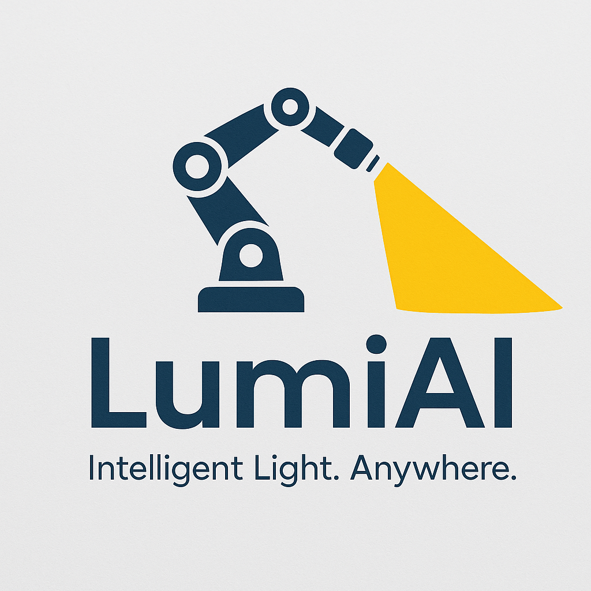

# 🚀 LumiAI Robotic Arm System

  
   
  <strong>Advanced AI-Powered Robotic Lighting Platform</strong>

---

# 🚀 Product Overview  

### Concept  
A **5-DOF robotic arm platform** integrating an **AI-driven optical camera** and a **versatile gripper-mounted lighting system**. Designed to be **modular and environment-adaptive**, the product enhances lighting control in **garages, kitchens, restaurants, and entertainment venues** by intelligently following human gestures, faces, and movement.  

### Key Features  
- **AI Vision System**:  
  - Arm-mounted **Arducam autofocus camera** for face and gesture recognition.  
  - **PIR sensor** for initial presence detection, enabling smart energy usage.  
- **Lighting System**:  
  - Relay-controlled spotlight (first release MVP).  
  - Future versions: RGB light effects, dynamic beam shaping, and synchronized music-light interactions.  
  - Flexible gripper mount allows swap-out between spotlight, floodlight, or decorative lighting attachments.  
- **Robotic Arm**:  
  - Imported **Hiwonder ArmPi FPV (5-DOF)** chassis from China.  
  - Modified in-house (US) with custom 3D-printed and CNC-machined parts for camera integration, UPS housing, and sensor boards.  
- **Hardware Platform**:  
  - **Raspberry Pi 5**, upgraded with **1 TB NVMe + 512 GB SD card**.  
  - Integrated **UPS module** for uninterrupted operation.  
  - **Relay and PIR boards** securely mounted on aluminum base plate.  
- **Software Stack**:  
  - **Restic** for automated local + cloud backups.  
  - AI models for gesture and face recognition (OpenCV + PyTorch/ONNX on RPi5).  
  - Future software roadmap: MQTT/REST API integration for home automation & restaurant lighting systems.  

### Differentiation  
- Most robotic lighting systems are **fixed-mount and pre-programmed** (DJ lights, moving head lights).  
- This product adds **true autonomy + human interaction**, making it ideal for smart homes, garages, kitchens, and **restaurants/bars seeking interactive ambiance**.  
- Scalable from **utility (garage task light)** to **experience (dance floor entertainment)**.  

---

# ⚙️ Production Plan  

### Phase 1 – MVP (Now → Year-End)  
- **Import Base Hardware**:  
  - Source Hiwonder ArmPi FPV units from China.  
- **Custom Modifications in US**:  
  - Replace camera mount with Arducam autofocus module.  
  - CNC/machine base plate to accommodate UPS + relay/PIR.  
  - Add 3D-printed shrouds for cable management & aesthetics.  
- **Integration**:  
  - Assemble in-house workshop (US).  
  - Validate software stack: presence detection → face recognition → spotlight tracking.  
- **Pilot Testing**:  
  - Garage/kitchen use cases.  
  - Lighting control reliability tests (relay stress tests).  

### Phase 2 – Pre-Production (Q1–Q2 Next Year)  
- **Vendor Consolidation**:  
  - Secure reliable Chinese suppliers for arm components.  
  - Negotiate batch discounts (50–100 units per order).  
- **US Assembly Line Setup**:  
  - Small batch assembly at a contract manufacturer or maker-space facility.  
  - Integrate UPS + PIR/relay mods.  
  - Quality control at final stage.  

### Phase 3 – Production Scaling (Q3 Next Year Onward)  
- **Volume Manufacturing**:  
  - Keep arm imports from China.  
  - Transition CNC/3D-print parts to **injection molding & laser-cut aluminum** for cost reduction.  
- **Supply Chain Strategy**:  
  - US assembly of sensitive electronics (UPS + Pi5 boards).  
  - Outsource light modules (RGB, spotlight heads) from established lighting suppliers.  

---

# 📈 Marketing Plan  

### Target Segments  
1. **Garage/Workshop Users**  
   - DIYers who want **auto-tracking work lights**.  
   - Key value: Convenience + hands-free smart lighting.  
2. **Smart Home Enthusiasts**  
   - Tech adopters who want **gesture/face recognition integrated with lighting**.  
   - Potential integration: Alexa, Google Home, Home Assistant.  
3. **Hospitality / Restaurants / Bars**  
   - Managers seeking **interactive lighting for ambience & entertainment**.  
   - Value: Spotlight a customer, track performers, or create dynamic dance floor effects.  

### Positioning  
- **Utility + Experience Hybrid**: A robotic spotlight that’s **functional in the home** and **engaging in commercial spaces**.  
- Marketed as both a **practical productivity tool** (garage/kitchen) and a **wow-factor entertainment device** (restaurants, bars).  

### Go-to-Market Strategy  
- **MVP Launch (Garage/Kitchen Focus)**  
  - Kickstarter or Indiegogo campaign to generate buzz.  
  - Position as a **“Smart Robotic Spotlight for Hands-Free Workspaces”**.  
- **Restaurant/Bar Expansion**  
  - Partner with small chains or local venues for **demo installations**.  
  - Create showcase videos (e.g., spotlight tracking a performer or changing colors with music).  
- **Channels**:  
  - D2C via website + Amazon.  
  - B2B via distributors in lighting and hospitality equipment.  
- **Pricing Strategy**:  
  - MVP kit: ~$499–699 retail (arm + Pi5 + UPS + spotlight module).  
  - Restaurant edition with RGB & effects: ~$999+.  
- **Branding**:  
  - Emphasize **human-centric AI** and **versatility**.  
  - Example brand names: *LumeArm*, *SpotBot*, *TrackLight AI*.  

---

# 📝 Next Steps  

1. **Lock MVP feature set** (relay spotlight + tracking).  
2. **Define assembly workflow** in the US (import → modify → test → package).  
3. **Create prototype demo video** for Kickstarter (garage → restaurant use case).  
4. **Engage early adopters** (maker communities, smart home forums, local restaurants).  
